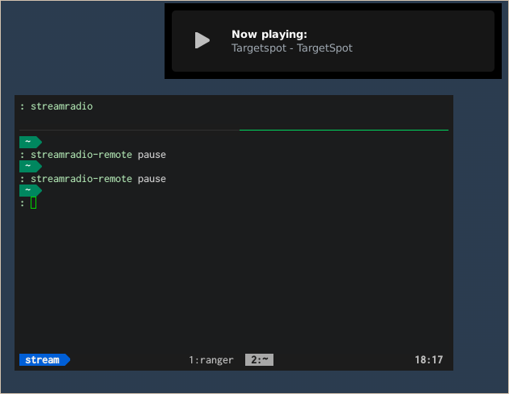

# streamradio

CLI application to stream radio station using mpg123.

# Description

streamradio provide you an easy way to listen to internet radio stations.
The application is written in bash, and use [mpg123](http://mpg123.de/) for playing radio stations.
mpg123 provides remote control by using fifo, and this srcipt can also provide remote control by `streamradio-remote` command.

If you can run `notify-send` command, this script also show the notification of ICY-TITLE.



# Usage

First, you can run `streamradio` like a daemon.

```
streamradio
```

Then, send command by `streamradio-remote`:

```
streamradio-remote start [URL or filename]
```

If you want to pwause the streaming, or to resume, use `streamradio-remote pause`:

```
streamradio-remote pause
```

To quit streamradio, run `streamradio-remote quit`.

```
streamradio-remote quit
```

my radio station list is [here](https://github.com/ssh0/dotfiles/blob/master/pyradio/stations.csv).

# Installation

If you like this application, you can try easily.

## Requirements

* [mpg123](http://mpg123.de/)
* [notify-osd](https://wiki.ubuntu.com/NotifyOSD)

If you use debain based Linux destribtuin, just run

```
sudo apt-get install mpg123
```

**Note**

If you use Mac or other distribution of Linux, you can change source code(only 24 lines!) suitable for your use.

**cf)** commandline-tool to send Notification in Mac OS X:

* [julienXX/terminal-notifier](https://github.com/julienXX/terminal-notifier)
* [Growl](http://growl.info/)

## Install command

clone this repository on your local computer.

```
git clone https://github.com/ssh0/streamradio.git ~/.git/streamradio
```

copy `stramraio` and `streamradio-remote` to the directory inculded in `$PATH`(ex. `~/bin` or `/usr/local/bin`)

```
sudo cp ~/.git/streamradio/streamradio /usr/local/bin/
sudo cp ~/.git/streamradio/streamradio-remote /usr/local/bin/
```

# License

This app is under [MIT](LICENSE) license.
